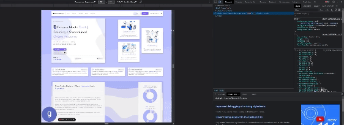
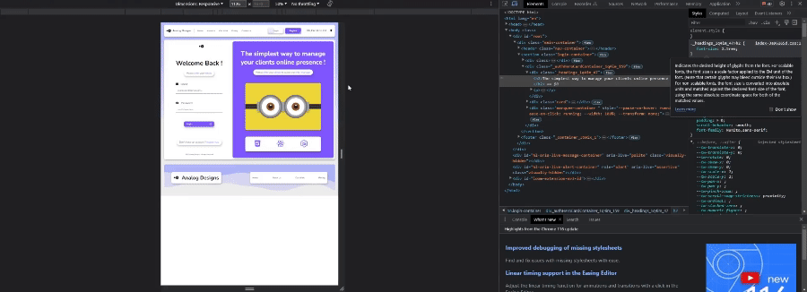
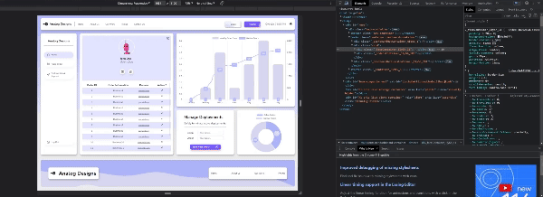

# Analog Designs

  <path d='M11 13a5 5 0 1 0-4.975-5.5H4A1.5 1.5 0 0 0 2.5 6h-1A1.5 1.5 0 0 0 0 7.5v1A1.5 1.5 0 0 0 1.5 10h1A1.5 1.5 0 0 0 4 8.5h2.025A5 5 0 0 0 11 13zm.5-7.5v2h2a.5.5 0 0 1 0 1h-2v2a.5.5 0 0 1-1 0v-2h-2a.5.5 0 0 1 0-1h2v-2a.5.5 0 0 1 1 0z'/></svg>"
  alt="Analog Designs Logo" />

## Introduction

The goal of Analog Designs is to offer mortgage brokers a simple, effective solution for generating websites for their clients who lack an online presence. Originally developed as a side project to assist friends in the mortgage business, Analog Designs aims to become a go-to solution for brokers beyond my immediate social circle.

## Problem Statement

After speaking with mortgage brokers and other professionals, it's clear that having an online presence significantly bolsters the legitimacy of an applicant. This service aims to be a cost-effective solution for brokers to improve the chances of loan approval for their clients.

## Goals

1. Create a visually appealing website to serve as a landing page for potential clients.
2. Develop reusable design templates in React to expedite the website creation process.
3. Implement user authentication to allow brokers to manage their websites and possibly take them offline post-approval.

## Features

## Features

Analog Designs offers the following key features to enhance the experience for both mortgage brokers and their clients:

- **Place Orders**: Users can effortlessly place orders for new websites right from the dashboard using emailJS api.
- **Order Follow-Up**: Keep track of existing orders with real-time status updates to ensure everything is progressing as planned.
- **Delete Deployments**: Provides the flexibility to delete deployed websites, giving brokers control over the online presence once the application is approved.
- **Add Testimonials**: Users can easily add testimonials to their websites, lending credibility and enhancing the site's authenticity.

These features aim to create a seamless, efficient process for mortgage brokers to improve their clients' chances of loan approval.

## Tech Stack

- Front-end: React, JavaScript, CSS, framer motion
- Back-end: Node.js or Python
- Database: MySQL
- Deployment: AWS

Note: The main website will make use of pure CSS to improve my grasp of the technology.

## Responsivness

I worked on 4 different layouts catered towards desktop, laptop, tablet, and phone

### Home page

### Login page

### Dash page

